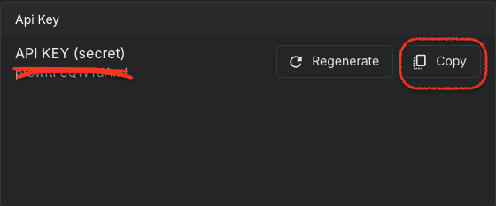

# VAAS (visualization as a service)
The javascript SDK to create, publish and share flexible data visualization.
You can use it in your `browser` or in `node.js`.

## Landing page
Visit vaas [landing page](https://columns.ai/dev) to get an overview of it.

## Installation
```bash
npm install columns-graph-model columns-sdk
```

Check the latest version used by vass-test in current repo [test project package.json](test/package.json).

## Usage
### prequisites
- [ ] create a Columns account at [columns.ai](https://columns.ai)
- [ ] grab your API key from your [profile](https://columns.ai/profile) page.



### basic usage
You can use the SDK in two ways: constrcut a graph object from scratch or use an existing graph as template.

1. construct a graph object from scratch
```javascript
const testFromScratch = async (columns: Columns): Promise<GraphData> => {
  // rows is an example data set where you should organize your data in a similar way.
  const data = columns.data(['state'], ['value'], rows);
  const graph = columns.graph(data);

  // switch to different chart types: BAR, PIE, DOUGHGUT, LINE, AREA, SCATTER, etc.
  graph.type = ChartType.COLUMN;

  // customise the graph (lots of options in its data model)
  graph.settings.general.palette = ['#ff0000', '#00ff00', '#0000ff'];
  graph.settings.general.background = '#00000002';

  return graph;
};
```

2. (OR) use an existing graph as template to provide new data
```javascript
// Call the API to generate the graph and publish it
// you can append "headless" to the returned URL for an embeddable link.
const testUsingTemplate = async (columns: Columns): Promise<GraphData> => {
  // load a template from a pre-designed graph from Columns, so we just need to feed the data
  // here we are using the example: https://columns.ai/visual/view/U6tALuJ3cTdPFw
  const visualId = 'U6tALuJ3cTdPFw';
  const graph = await columns.template(visualId);

  // customise the graph (lots of options in its data model)
  if (!graph) {
    console.log(`Failed to load template from Columns: ${visualId}`);
    return;
  }

  // rows is an example data set where you should organize your data in a similar way.
  const data = columns.data(['state'], ['value'], rows);
  graph.data = data;

  return graph;
};
```

3. put all together publish the graph to Columns to get viewable link to share or embed
```javascript
  // publish the graph and get a new URL
  const url = await columns.publish('test-template-api', graph);
  console.log(`Columns graph: ${url}`);
```

After executing a few lines of code as shown above, you will get a new link in the console, similar like 
```shell
https://columns.ai/visual/view/g-v0dK1sZUMlMeG4
```

or

```shell
https://columns.ai/visual/view/g-qsQ3ySWSnFHJ9x
```

The same visual ID can be embeddable in your app or using the pure embed URL, eg. 
```shell
https://columns.ai/embed/g-qsQ3ySWSnFHJ9x
```

## Run example
How to run the example in test folder:
1. clone this repo: `git clone https://github.com/varchar-io/vaas`
2. go to test folder: `cd vaas/test`, replace the {YOUR_API_KEY} in `index.ts` with your own API key obtained from [columns.ai](https://columns.ai/profile)
3. build and run: `yarn && node dist/index.js`

Open the URL in your browser returned from the test run. Customize the graph object and run it again see the changes.

## API
`vaas` is the code name for Columns SDK. It is a javascript library that allows you to create, publish and share data visualization.
The SDK includes all the core graphing object models and the API client to interact with the Columns API.
The major interfaces of the SDK are:
- `data` - the data model.
- `graph` - the graph model.
- `template` - the API client to load a pre-designed graph from Columns.
- `publish` - the API client to publish the graph to Columns.


Besides the core data and core graph, other models are also available to customize the graph:
- `theme` - the theme model that allow us to apply pre-built theme to the current graph.
- `access` - the access model that allow us to control the access to the graph: public or restricted to a list of people.
- `elements` - the elements model that allow us to control the elements of the graph: title, subtitle, annotations, arrows, widgets, etc.
- `settings` - the settings model that allow us to control the settings of the graph: layout, color, background, font, etc.


## Future work
Current version of the SDK is the `visualization` part of Columns that allows you to create, publish and share data visualization.
In the future, we will add the `analytics` part of Columns that allows you to connect any data and query to generate the "data model" on demand.
Please share your feedback and let us know what you think.

## Try now
You can try the SDK right now. If you have any questions, please create an issue or reach out using any of the [channels](https://columns.ai/contact) below.
